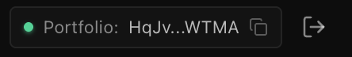
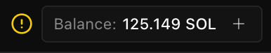
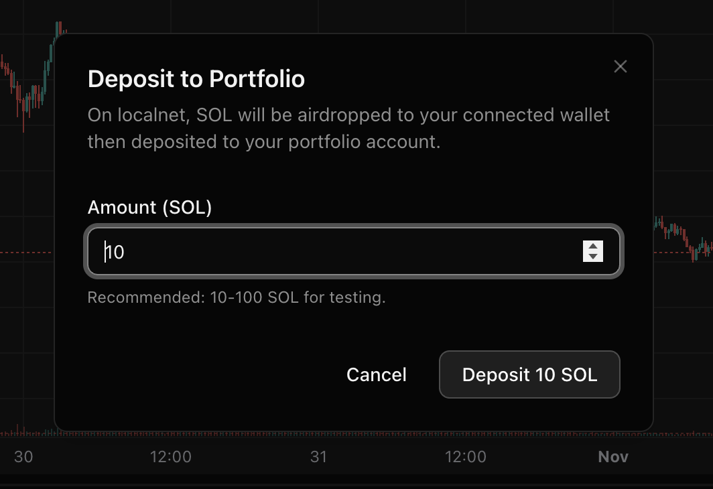
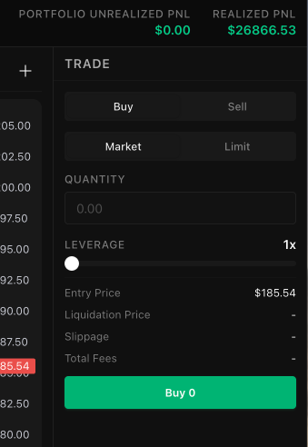

## Localnet Trading Simulator Setup Guide

## Prerequisites

### 1. System Requirements

```bash
# Required software
- Rust 1.70+
- Solana CLI 1.16+
- Node.js 18+

# Verify installations
rustc --version
solana --version
node --version
```

### 2. Repository Setup

```bash
# Clone the repository (only needed for deploying programs)
git clone https://github.com/barista-dex/barista-dex.git
cd barista-dex
```

### 3. Environment Variables Reference

After deploying programs (Step 2), you'll need to configure these environment variables.

These are environment variables you will need to setup in your CLIs that you will use to run the commands below. There's a set of environment variables that needs to be added to a .env.local file in the UI directory, but that will come later.

| Variable | Required? | Description | When to Set |
|----------|-----------|-------------|-------------|
| `BARISTA_LOCALNET_ROUTER_PROGRAM_ID` | **Yes** | Router program ID from deployment | After Step 2 |
| `BARISTA_LOCALNET_SLAB_PROGRAM_ID` | **Yes** | Slab program ID from deployment | After Step 2 |
| `BARISTA_ORACLE_PROGRAM` | **Yes** | Oracle program ID (for percolator-keeper) | After Step 2 |
| `BARISTA_ROUTER_PROGRAM` | **Yes** | Router program ID (for percolator-keeper, same as BARISTA_LOCALNET_ROUTER_PROGRAM_ID) | After Step 2 |
| `BARISTA_LOCALNET_RPC` | No | RPC endpoint (default: `http://localhost:8899`) | Optional |
| `BARISTA_DLP_KEYPAIR` | Yes | DLP wallet path (convenience for cli-dlp) | After Step 4.1 |
| `BARISTA_DLP_NETWORK` | No | Network name (convenience for cli-dlp) | After Step 4.1 |

---

## Step 1: Start Localnet

Start a fresh Solana test validator:

```bash
# Start localnet (in separate terminal - keep this running)
solana-test-validator --reset

# In another terminal, configure Solana CLI to use localhost
solana config set --url localhost

# Verify connection
solana cluster-version
```

**Keep the validator running throughout this guide.**

---

## Step 2: Deploy Programs

Deploy the three core programs to localnet:

### Build Programs

First, build all the Solana programs:

```bash
# Build all programs (from repo root)
./build-programs.sh

# This builds router, slab, oracle, and amm programs
# Output files will be in target/deploy/
```

### Deploy Router Program

```bash
# Deploy router
solana program deploy target/deploy/percolator_router.so

# Save the program ID
# Output: Program Id: <ROUTER_PROGRAM_ID>
```

### Deploy Slab Program

```bash
# Deploy slab
solana program deploy target/deploy/percolator_slab.so

# Save the program ID
# Output: Program Id: <SLAB_PROGRAM_ID>
```

### Deploy Oracle Program

```bash
# Deploy oracle
solana program deploy target/deploy/percolator_oracle.so

# Save the program ID
# Output: Program Id: <ORACLE_PROGRAM_ID>
```

**Important**: Save all three program IDs - you'll need them for the next steps.

### Configure Environment Variables

After deploying the programs, configure environment variables so the CLI tools can find them:

```bash
# Add these to your ~/.bashrc, ~/.zshrc, or export them in your terminal session

# Required: Program IDs from deployment
export BARISTA_LOCALNET_ROUTER_PROGRAM_ID=<ROUTER_PROGRAM_ID>
export BARISTA_LOCALNET_SLAB_PROGRAM_ID=<SLAB_PROGRAM_ID>

# Optional: RPC endpoint (defaults to http://localhost:8899 if not set)
export BARISTA_LOCALNET_RPC=http://localhost:8899

# For percolator-keeper binary (oracle operations and registry)
export BARISTA_ORACLE_PROGRAM=<ORACLE_PROGRAM_ID>

# IMPORTANT: percolator-keeper uses BARISTA_ROUTER_PROGRAM (not BARISTA_LOCALNET_ROUTER_PROGRAM_ID)
# Set this to the same value as BARISTA_LOCALNET_ROUTER_PROGRAM_ID for localnet
export BARISTA_ROUTER_PROGRAM=<ROUTER_PROGRAM_ID>

# Verify configuration
echo "Router: $BARISTA_LOCALNET_ROUTER_PROGRAM_ID"
echo "Slab: $BARISTA_LOCALNET_SLAB_PROGRAM_ID"
echo "Oracle: $BARISTA_ORACLE_PROGRAM"
echo "Keeper Router: $BARISTA_ROUTER_PROGRAM"
```

**Note**: The npm packages (@barista-dex/sdk, @barista-dex/cli-dlp, @barista-dex/cli-client) will automatically use these environment variables for localnet. Mainnet and devnet program IDs are hardcoded in the SDK.

**Important**: The `percolator-keeper` binary reads `BARISTA_ROUTER_PROGRAM` (not `BARISTA_LOCALNET_ROUTER_PROGRAM_ID`). Make sure to set both variables to the same router program ID for localnet operations.

---

## Step 3: Initialize Router Registry

The router needs a registry account for PnL vesting and liquidation parameters. This is a **one-time protocol setup step** performed during deployment.

See [REGISTRY_INITIALIZATION.md](./REGISTRY_INITIALIZATION.md) for detailed instructions.

**Quick setup for localnet:**

```bash
# Build keeper binary if not already built
cargo build --release --bin percolator-keeper

# IMPORTANT: Make sure BARISTA_ROUTER_PROGRAM is set (from Step 2)
# The keeper uses this env var, not BARISTA_LOCALNET_ROUTER_PROGRAM_ID
echo "Keeper will use router: $BARISTA_ROUTER_PROGRAM"

# Initialize registry
./target/release/percolator-keeper registry init \
  --keypair ~/.config/solana/id.json \
  --rpc-url http://localhost:8899

# Expected output:
# ✓ Registry initialized successfully!
#   Registry PDA: AjxXizziXXRneEskQ54GPYjKd8ChDGfma9ovG5mYKiey
#   Governance: 3sEw2iqZEuBX9s9DeN8BcUpqaeRoi9BbziQT5QjRwAnN
#   Signature: <TX_SIG>
```

**Troubleshooting**: If you get "Attempt to load a program that does not exist", verify that `BARISTA_ROUTER_PROGRAM` is set to your deployed router program ID.

**Note**: The `registry init` subcommand needs to be added to percolator-keeper. See REGISTRY_INITIALIZATION.md for implementation details.

---

---

## Step 4: Setup DLP (Liquidity Provider)

As the DLP, you'll provide liquidity and act as counterparty for all trades.

**⚠️ CRITICAL**: You MUST set `BARISTA_DLP_KEYPAIR` environment variable before using barista-dlp commands. Due to Commander.js limitations, the `--keypair` flag doesn't work properly without this environment variable set.

### 4.1: Create DLP Wallet

```bash
# Create a dedicated DLP wallet
solana-keygen new --outfile ~/.config/solana/dlp-wallet.json

# Get the address
solana-keygen pubkey ~/.config/solana/dlp-wallet.json
# Save this: <DLP_PUBKEY>

# ⚠️ CRITICAL: Set the environment variable NOW
# Replace <YOUR_USER> with your actual username
export BARISTA_DLP_KEYPAIR=/Users/<YOUR_USER>/.config/solana/dlp-wallet.json

# Fund the wallet (1002 SOL: 1000 for capital + 2 for fees)
solana airdrop 1002 <DLP_PUBKEY> --url localhost

# Verify balance
solana balance <DLP_PUBKEY> --url localhost
# Should show: 1002 SOL
```

### 4.2: Install DLP CLI

```bash
# Install the DLP CLI globally from npm
npm install -g @barista-dex/cli-dlp

# Verify installation
barista-dlp --help

# Or use npx (no installation required)
npx @barista-dex/cli-dlp --help

# IMPORTANT: Set the DLP keypair environment variable
# The CLI requires this due to Commander.js option parsing
export BARISTA_DLP_KEYPAIR=/Users/<YOUR_USER>/.config/solana/dlp-wallet.json

# Optional: Set network (defaults to localnet)
export BARISTA_DLP_NETWORK=localnet

# Note: These environment variables are REQUIRED for barista-dlp CLI.
# Without BARISTA_DLP_KEYPAIR set, the --keypair flag won't work properly.
# The program IDs must be set in Step 2 (BARISTA_LOCALNET_ROUTER_PROGRAM_ID, etc.)
```

### 4.3: Deposit Capital

```bash
# IMPORTANT: Ensure BARISTA_DLP_KEYPAIR is set first!
# export BARISTA_DLP_KEYPAIR=/Users/<YOUR_USER>/.config/solana/dlp-wallet.json

# Deposit 1000 SOL to DLP portfolio (auto-creates portfolio)
barista-dlp deposit --amount 1000000000000 --network localnet

# Note: --keypair is optional if BARISTA_DLP_KEYPAIR is set
# If not set, the command will fail with "--keypair is required"

# Expected output:
# ✓ Portfolio initialized
# ✓ Deposited 1000.0 SOL to portfolio!

# Verify portfolio
barista-dlp portfolio

# Expected output:
# ═══════════════════════════════════════
#          DLP Portfolio Summary
# ═══════════════════════════════════════
# Principal (Deposited)    1000.0 SOL
# Realized PnL             +0.0 SOL
# ───────────────────────────────────────
# Total Equity             1000.0 SOL
```

### 4.4: Create Instrument (Market Identifier)

```bash
# Generate a keypair for SOL-PERP instrument
solana-keygen new --no-bip39-passphrase --outfile ./sol-perp-instrument.json

# Get the instrument ID
solana-keygen pubkey ./sol-perp-instrument.json
# Save this: <INSTRUMENT_ID>
```

### 4.5: Create Slab

```bash
# IMPORTANT: Ensure BARISTA_DLP_KEYPAIR is set first!
# export BARISTA_DLP_KEYPAIR=/Users/<YOUR_USER>/.config/solana/dlp-wallet.json

# Create slab (commands updated - use dash instead of colon)
barista-dlp slab-create

# Or specify all parameters:
barista-dlp slab-create \
  --instrument <INSTRUMENT_ID> \
  --mark-price 50000.00 \
  --taker-fee 10 \
  --contract-size 1.0 \
  --network localnet \
  --yes

# Expected output:
# ✓ Slab created successfully!
#   Slab Address: <SLAB_ADDRESS>
#   Signature: <TX_SIGNATURE>
#
# ⚠ Save this slab address! You'll need it for trading

# Verify slab
barista-dlp slab-view --address <SLAB_ADDRESS> --detailed

# Expected output:
# ═══════════════════════════════════════
#            Slab Information
# ═══════════════════════════════════════
# Slab Address         <SLAB_ADDRESS>
# LP Owner (DLP)       <DLP_PUBKEY>
# Mark Price           $50,000.00
# Taker Fee            10.00 bps
# Contract Size        1.000000
```

### 4.6: Initialize Oracle

Use the keeper binary for oracle operations:

```bash
# Build keeper if not already built
cargo build --release --bin percolator-keeper

# Set oracle program ID for convenience
export BARISTA_ORACLE_PROGRAM=<ORACLE_PROGRAM_ID>

# Initialize oracle for the instrument
./target/release/percolator-keeper oracle init \
  --instrument <INSTRUMENT_ID> \
  --price 50000 \
  --keypair ~/.config/solana/dlp-wallet.json \
  --rpc-url http://localhost:8899

# Expected output:
# ✓ Oracle initialized successfully!
#   Oracle Address: 8xR4tP...nZk3vL
#   Instrument: <INSTRUMENT_ID>
#   Initial Price: $50,000.00
#   Authority: <DLP_PUBKEY>
#
# ⚠ Save the oracle address!

# Save the oracle address: <ORACLE_ADDRESS>

# Verify oracle
./target/release/percolator-keeper oracle show \
  --oracle <ORACLE_ADDRESS> \
  --rpc-url http://localhost:8899
```

For automated price updates from real market data (CoinGecko API):

```bash
# Start oracle crank (fetches from CoinGecko by default)
./target/release/percolator-keeper oracle crank \
  --oracle <ORACLE_ADDRESS> \
  --instrument BTC \
  --keypair ~/.config/solana/dlp-wallet.json \
  --rpc-url http://localhost:8899 \
  --interval 30

# Example for different assets:
# BTC:  --instrument BTC
# ETH:  --instrument ETH
# SOL:  --instrument SOL
# USDC: --instrument USDC
# USDT: --instrument USDT

# Or use full instrument names:
# BTC/USD, BTC-PERP, ETH/USD, SOL-PERP, etc.
# The crank extracts the base symbol (BTC, ETH, SOL) and maps to CoinGecko ID

# The crank will:
# - Fetch current price from CoinGecko API every 30 seconds
# - Update the on-chain oracle if price changed significantly
# - Display price updates in terminal
# - Run continuously until you press Ctrl+C

# You can also specify the price source explicitly:
./target/release/percolator-keeper oracle crank \
  --oracle <ORACLE_ADDRESS> \
  --instrument SOL \
  --source coingecko \
  --interval 30 \
  --keypair ~/.config/solana/dlp-wallet.json \
  --rpc-url http://localhost:8899

# Other supported sources:
# --source binance   (for Binance spot prices)
# --source coinbase  (for Coinbase prices)

# Press Ctrl+C to stop the crank
```

**Supported Instrument Symbols** (auto-mapped to CoinGecko):
- `BTC` → bitcoin
- `ETH` → ethereum
- `SOL` → solana
- `USDC` → usd-coin
- `USDT` → tether
- Any other symbol → used as-is (must match CoinGecko ID)

**Find CoinGecko IDs**: https://www.coingecko.com/

---

**Your DLP setup is complete!** You now have:
- ✅ Portfolio with 1000 SOL capital
- ✅ Slab for BTC-PERP trading
- ✅ Oracle for price feeds


## Step 5: Setup Your Trading Wallet

Create trader accounts to simulate a trading environment.

### 5.1: Create Trader Wallet

```bash
solana-keygen new --outfile ~/.config/solana/trading.json

# Verify creation, should return your pubkey
solana-keygen pubkey ~/.config/solana/trading.json
```

### 5.2 Configure Your Environment Variables in UI directory

From root directory, navigate to ui

```bash
cd ui
```

Then, create a file called .env.local with the following env variables

```bash
# Wallet Configuration
NEXT_PUBLIC_WALLET_MODE=localnet

# Localnet Wallet - Replace with your keypair from ~/.config/solana/id.json
# To get it: cat ~/.config/solana/id.json
NEXT_PUBLIC_LOCALNET_PRIVATE_KEY='[..., ..., ...]'

# Network Configuration
NEXT_PUBLIC_NETWORK=localnet
NEXT_PUBLIC_RPC_URL=http://localhost:8899

# Program IDs for localnet (set your deployed program IDs here)
# Use NEXT_PUBLIC_ prefix so they're available in the browser
NEXT_PUBLIC_ROUTER_PROGRAM_ID=<ROUTER_PROGRAM_ID>
NEXT_PUBLIC_SLAB_PROGRAM_ID=<SLAB_PROGRAM_ID>

# Oracle Program ID (optional - only needed for localnet to fetch live prices)
# Get this from: solana program deploy target/deploy/percolator_oracle.so
NEXT_PUBLIC_ORACLE_PROGRAM=<ORACLE_PROGRAM_ID>

# Feature Flags
NEXT_PUBLIC_SHOW_DEBUG_INFO=true
NEXT_PUBLIC_AUTO_CONNECT=true
```

## Step 6: Start UI Server

Start your UI server to start trading

In UI directory, run

```bash
pnpm install
pnpm dev
```

You will now see that server started running on localhost:3000.

Navigate to that in your browser.

If you configured the environment variables correctly as seen above, you should see that you are automatically authenticated



As you can see, your portfolio account is automatically created, but you need to deposit to it. In localnet, it's as simple as clicking on the plus icon in the Balance display in the navbar, and specifying an amount to deposit. It will be airdropped to your connected wallet first, then deposited to your portfolio account. Your balance should then reflect this deposited amount.






## Step 7: Start Trading!

You can start trading now.

